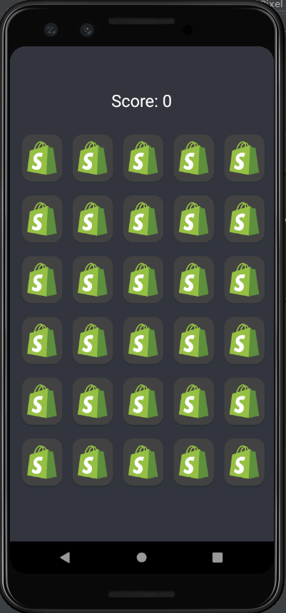
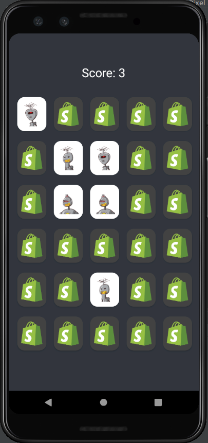
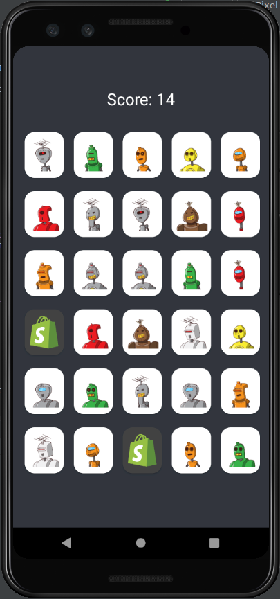
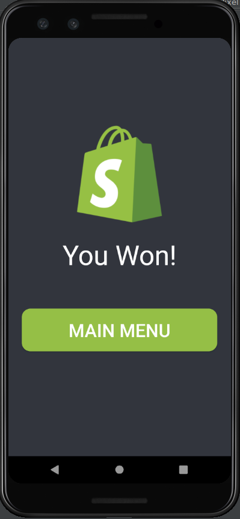

# ProductMatch
An Android Memory Matching game 

This Game was created by utilisizing a recyclerview with a GridLayoutManager so that we could inflate the cards instead of manually inputing them.

### Screenshots 
### Main menu

#### New Game -- no moves made

#### In Game -- a couple moves made; 3 matches

### Game Almost Won -- one more match to make!

#### Game Won -- All 15 matches made!

### Libraries Used 
- [Glide](https://github.com/bumptech/glide) 
